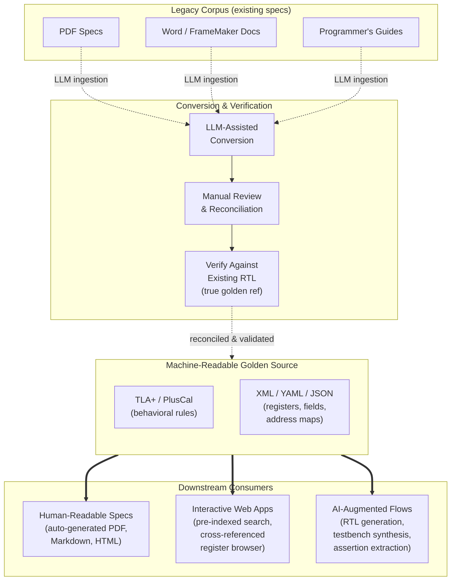

Every hardware team has lived this: a 400-page PDF spec says one thing, the
RTL says another, and the testbench assumes a third.  The bug that falls out
is nobody's fault and everybody's problem.  Now multiply that failure mode by
an LLM that has no judgment about which source to trust — and "making
something up" becomes the default behavior whenever the input is ambiguous.

If we are serious about AI-augmented hardware design, we need to fix the
input before we fix the model.

## Ease of Consumption — Not Just for Humans

Architectural specifications have historically been written for humans.
They are prose documents — Word files, Confluence pages, PDFs — optimized
for readability by an engineer who already has context.  That works (barely)
when the consumer is a person who can resolve ambiguity by walking to the
next cubicle.

It does not work when the consumer is an LLM.

Large language models are *extremely* sensitive to the quality of their
input.  Give an LLM a clean, unambiguous, machine-readable rule set and it
will generate correct RTL, accurate testbench stimulus, and valid
configuration sequences.  Give it a vague paragraph with an implicit
cross-reference to a table four sections away and it will *hallucinate
plausible-looking logic that is wrong*.

The problem is not the model.  The problem is the specification.

## The Single Source of Truth

The fix is a **machine-readable golden source** — a structured, formal
representation of the design's rules and behaviors from which *everything
else* is derived.  Not "also maintained alongside the PDF," but the actual
source of record.

The thick arrows from the golden source are the steady-state flow: every
consumer reads from the same canonical data. The dashed lines on the top
represent the *one-time migration* — the up-front work required to get there.

## Why Formal Modeling Matters for Fabrics

An I/O-memory fabric is governed by rules: ordering constraints, credit
protocols, arbitration policies, coherence state transitions, deadlock
freedom invariants. These are not well captured by prose. They *are* well
captured by temporal logic.

**TLA+** (Temporal Logic of Actions) and its procedural alias **PlusCal**
let you express exactly these kinds of rules:

- *"A posted write must not pass a completion with the same requester ID."*
- *"Credits are returned only after the receiver has consumed the
  corresponding data."*
- *"No reachable state exists in which two agents hold exclusive ownership
  of the same cache line."*

A TLA+ specification is simultaneously:

1. **Precise enough for a model checker** (TLC) to exhaustively verify.
2. **Readable enough for a human** to review the intent.
3. **Structured enough for an LLM** to consume without ambiguity.

That last property is the one most teams overlook.  When the fabric's
ordering rules live in a formal spec, an LLM generating RTL for an arbiter
or a reorder buffer can be given the *exact* invariants it must satisfy —
not a paragraph of English that it might misinterpret.

## The Migration Path

None of this is free.  For a team with an existing design, the path looks
roughly like this:

### Step 1 — Convert the existing corpus

Take every PDF spec, programmer's guide, and architecture note and convert
it into machine-readable form (structured YAML/JSON for register maps,
TLA+ for behavioral rules).

This is where LLMs can actually help *today*. Feed the prose documents
into a well-prompted model and let it produce a first-draft structured
output. But — and this is critical — **every generated artifact must be
manually reviewed**. LLMs are good at format conversion; they are not
reliable at semantic interpretation of ambiguous prose.

### Step 2 — Verify against the existing RTL

The existing RTL is the *true* golden reference (it is, after all, what the
silicon actually does). Use it to validate the converted specs:

- Run the TLA+ model checker against properties extracted from the RTL.
- Diff the machine-readable register maps against the RTL's CSR decoder.
- Flag every discrepancy — these are either spec bugs, RTL bugs, or both.

This step is painful but enormously valuable. It's virtually guaranteed to yield discovery of long-standing bugs hiding in the gap between the spec
and the implementation.

### Step 3 — Flip the flow

Once the golden source is validated, *stop editing the sources (PDF, Word, FrameMaker, etc.) directly*. All changes start in the machine-readable source.  Human-readable documents, interactive tools, and AI pipelines all consume from the same root.

## Interactive Specifications

A machine-readable golden source enables a class of tooling that PDFs
simply cannot support: **interactive, pre-indexed, cross-referenced
specification browsers**.

Imagine a web app where an engineer can:

- Search across *all* specs simultaneously with structured filters
  (e.g. "show me every register in the fabric's credit manager that has
  a reset value other than zero").
- Click a register field and immediately see every ordering rule, every
  TLA+ invariant, and every testbench sequence that touches it.
- Get answers in seconds instead of grep-ing through a dozen PDFs.

This is not speculative.  It is a straightforward engineering project once
the data is structured.

### A Concrete Example: Generated CSR Documentation

To make this tangible, I built a Python tool that parses a
machine-readable register specification (XML) and generates a fully
self-contained, interactive HTML documentation site — no server, no
database, just static files.  The golden source describes every
control/status register: address maps, instances, bit-field definitions,
reset values, access policies, and cross-references.  The output is a
set of interlinked HTML pages with:

- **Instant global search** — a pre-built JSON index embedded in the
  HTML enables client-side substring matching across every register and
  bit-field.  Press `/` to open the search modal; results appear as you
  type.
- **Visual bit-field diagrams** — each register rendered as a per-bit
  HTML table showing bit numbers, reset values, and color-coded field
  names.
- **Deep linking** — every register has a stable URL anchor and a
  copy-to-clipboard button, so engineers can paste direct links into bug
  reports instead of referencing page numbers in a PDF.
- **Keyboard-driven navigation** — shortcuts for search, compact mode,
  and scroll-to-top, all designed for quick lookup during debug sessions.
- **Zero runtime dependencies** — CSS and JavaScript are inlined; the
  output works from a file share, a web server, or a CI artifact.

The point is not the specific tool — it is the *pattern*.  Once the
register specification lives in a structured, machine-readable format,
building this kind of interactive, searchable, deeply-linked
documentation is a weekend project.  Doing the same thing from a PDF
is effectively impossible.

## The Up-Front Cost and the Payoff

Let's be honest: the up-front work is significant. Converting a mature
design's specification corpus into machine-readable form is a
multi-quarter effort, even with LLM assistance. It requires
domain experts reviewing every conversion, resolving every ambiguity,
and reconciling every spec-vs-RTL discrepancy.

The payoff is equally significant:

- **AI-augmented RTL generation** becomes viable because the input is
  unambiguous.
- **Spec-RTL drift** becomes structurally impossible — the spec *is* the
  input to the toolchain.
- **Onboarding time** drops dramatically when new engineers can search
  and browse instead of reading binders.
- **Bug density** decreases because the formal model catches classes of
  errors (ordering violations, deadlocks, credit leaks) before any RTL
  is written.

The teams that begin this migration now will have a compounding advantage
over those that wait. The cost of conversion is fixed; the cost of
*not* converting grows with every generation of AI tooling that could
have consumed the spec but couldn't because it was trapped in a PDF.
