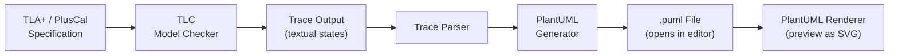
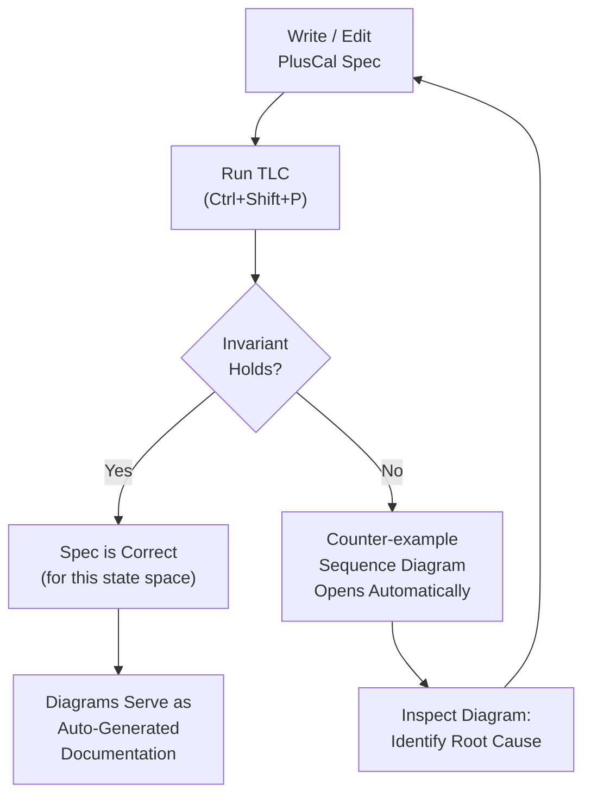

In a [previous post](/2026/02/22/machine-readable-specs-single-source-of-truth/)
I argued that machine-readable specifications are the foundation for
AI-augmented hardware design.  This post digs into a specific tool for
that job: **TLA+** and its procedural front-end **PlusCal**.

## What TLA+ Brings to Hardware Architecture

TLA+ (Temporal Logic of Actions) is a formal specification language for
describing concurrent and distributed systems.  PlusCal is a
pseudocode-like layer that compiles down to TLA+, making it accessible
to engineers who are more comfortable with imperative algorithms than
with temporal logic.

The key properties that make TLA+/PlusCal valuable for fabric and
protocol architecture:

- **Exhaustive model checking.**  The TLC model checker explores every
  reachable state of the specification, proving invariants
  (e.g. no deadlock, mutual exclusion, ordering guarantees) or
  producing a concrete counter-example trace when a property is
  violated.
- **Deadlock analysis.**  TLC can detect deadlocked states — situations
  where the system has not terminated but no process can take a step.
  For a fabric with credit-based flow control, this catches credit
  leaks and circular dependencies that are nearly impossible to find
  by inspection.
- **Precise enough for machines, readable enough for humans.**  A TLA+
  spec is simultaneously a mathematical proof artifact and a document
  that an architect can review for intent.  It is also structured
  enough for an LLM to consume without ambiguity — unlike prose.

## The Visualization Problem

There is a catch.  TLC's output is purely textual.  When the model
checker finds a counter-example — a sequence of states that violates
an invariant or leads to deadlock — the output looks like a wall of
nested records:

```
State 1: <Initial predicate>
/\ cache = (p1 :> "I" @@ p2 :> "I")
/\ bus = <<>>
/\ memory = [addr1 |-> 0]
/\ _seqDiagramTrace = <<>>

State 2: p1 issues ReadReq
/\ cache = (p1 :> "IS_D" @@ p2 :> "I")
/\ bus = <<[msg |-> "ReadReq", src |-> "p1", dst |-> "Memory", ch |-> "req"]>>
/\ _seqDiagramTrace = << [msg |-> "ReadReq", src |-> "p1", dst |-> "Memory", ch |-> "req"] >>
...
```

For a protocol architect, the natural visualization of this trace is a
**sequence diagram** — it immediately shows who sent what, to whom,
and in what order.  But drawing sequence diagrams by hand is exactly
the kind of busywork that slows down the specification process:

- **Architects spend hours in Visio** drawing message flows that are
  already fully described by the formal model.
- **Diagrams are out of date the moment they are published** — the
  model evolves, but nobody updates the Visio file.
- **It is nearly impossible to draw all combinations** manually.  A
  four-processor MESI protocol has hundreds of interesting interleavings.
  No one is going to draw each one by hand.

## Generating Sequence Diagrams from TLC Traces

To close this gap, I contributed an enhancement to the
[TLA+ VS Code extension](https://github.com/tlaplus/vscode-tlaplus)
that **automatically generates PlantUML sequence diagrams from TLC
model-checking traces**.

### How It Works

The flow is fully automatic — no commands to invoke, no buttons to
click:



1. **The user runs TLC** from VS Code as usual.
2. The extension captures TLC's raw stdout.
3. After TLC completes, a **trace parser** extracts a designated
   trace variable (by default `_seqDiagramTrace`) from the output.
   This variable is a TLA+ sequence of records, each with `msg`
   (message label), `src` (source participant), `dst` (destination
   participant), and an optional `ch` (channel, for color grouping).
4. A **PlantUML generator** converts the parsed messages into `.puml`
   text — declaring participants in first-appearance order, assigning
   colors per channel from an 8-color palette, and rendering arrows
   with autonumbered labels.
5. The generated `.puml` opens automatically in a side-by-side editor
   tab, ready for preview with any PlantUML renderer extension.

The extension generates PlantUML *text*, not rendered images.  This
avoids bundling a 20 MB `plantuml.jar` and lets users choose their
preferred renderer.  The contribution is the generation engine.

### The Trace Variable Convention

The only requirement on the TLA+ specification is that it maintain a
sequence variable containing the message history.  In PlusCal, this
typically looks like:

```
_seqDiagramTrace := Append(_seqDiagramTrace,
    [msg |-> "ReadReq", src |-> self, dst |-> "Memory", ch |-> "req"]);
```

Each record has:

| Field | Required | Purpose |
|-------|----------|---------|
| `msg` | Yes | Arrow label (e.g. "ReadReq", "DataResp") |
| `src` | Yes | Source participant |
| `dst` | Yes | Destination participant |
| `ch`  | No | Channel name — messages on the same channel share a color |

If `ch` is omitted, each distinct `msg` type gets its own color
automatically.  The variable name is configurable via a VS Code
setting.

### Concurrent Region Detection

The most interesting part of the generator is its handling of
concurrency.  When TLC produces multiple terminal traces (via
exhaustive state-space exploration), the generator compares all traces
against a canonical first trace to identify:

- **Fixed positions** — messages that appear at the same index in
  every trace.  These are sequential steps.
- **Variant regions** — contiguous ranges where message order differs
  across traces.  These represent true concurrency.

Variant regions are recursively split into **independent concurrent
chains** — subsets whose internal order is stable but whose relative
ordering with other subsets varies.  The result is rendered using
PlantUML's `par` / `group` constructs with distinct colors:

```
par Concurrent Chains
  group #FF6B6B Chain 1
    p1 -> Memory : ReadReq
  end
  group #00BBF9 Chain 2
    p2 -> Memory : ReadReq
  end
end
```

This means you see not just *a* trace but the *structure of the
concurrency* — which messages are ordered and which are independent.

### Color Coding

Messages are color-coded by channel (or by message type if no channel
is specified) using an 8-color palette — red, blue, green, orange,
purple, teal, deep-orange, indigo.  When an explicit `ch` field is
present, the channel name is annotated below the arrow label in a
smaller font.  Concurrent region boxes use a separate 6-color palette.

The visual result is that you can instantly distinguish traffic on
different channels (request vs. data vs. snoop, for example) without
reading every label.

### Example: Snoopy-Bus MESI Protocol

Here is a screenshot of a sequence diagram generated from a TLA+
specification of a textbook snoopy-bus MESI cache-coherence protocol.
The model describes processors issuing reads and writes, the bus
arbitrating between them, and caches transitioning through Modified,
Exclusive, Shared, and Invalid states.


_Sequence diagram auto-generated from TLC output.  Each arrow is a
protocol message; colors distinguish channels (request, data, snoop).
Autonumbering shows the global message order._

This diagram was not drawn by hand.  It was generated directly from
the TLC model checker's trace output — the formal model *is* the
documentation.  If the model changes, re-running TLC produces an
updated diagram automatically.

## The Iterative Modeling Loop

The real payoff is in how this changes the specification workflow:



Without visualization, the loop is: edit spec → run TLC → read 200
lines of textual state → squint → maybe understand the bug → edit
spec.  With automatic diagram generation, the loop becomes: edit spec
→ run TLC → *look at the picture* → see the bug → fix it.

The time from "TLC found a violation" to "I understand what went
wrong" drops from minutes to seconds.  Over the course of a
multi-week specification effort, that compounds into days of saved
time — and the diagrams are documentation artifacts you keep.

## Why This Matters for Fabric Architecture

A fabric specification involves exactly the kind of multi-agent,
message-passing, ordering-sensitive behavior that TLA+ was designed
for.  The message types are protocol-specific (requests, completions,
snoops, credits), the participants are fabric agents (requesters,
completers, home agents, snoop filters), and the invariants are the
ordering rules and deadlock-freedom properties the fabric must
guarantee.

By writing the specification in TLA+/PlusCal:

- **The model checker proves properties** that simulation would take
  years to cover.
- **Counter-examples are visualized automatically** as sequence
  diagrams that the entire team can read.
- **The diagrams stay in sync** with the model because they are
  generated from it — not maintained separately.
- **The spec is machine-readable** — it can feed directly into
  AI-augmented RTL generation and testbench synthesis pipelines.

Architects no longer have to choose between a formal model (for
correctness) and pretty diagrams (for communication).  They get both
from the same source.
