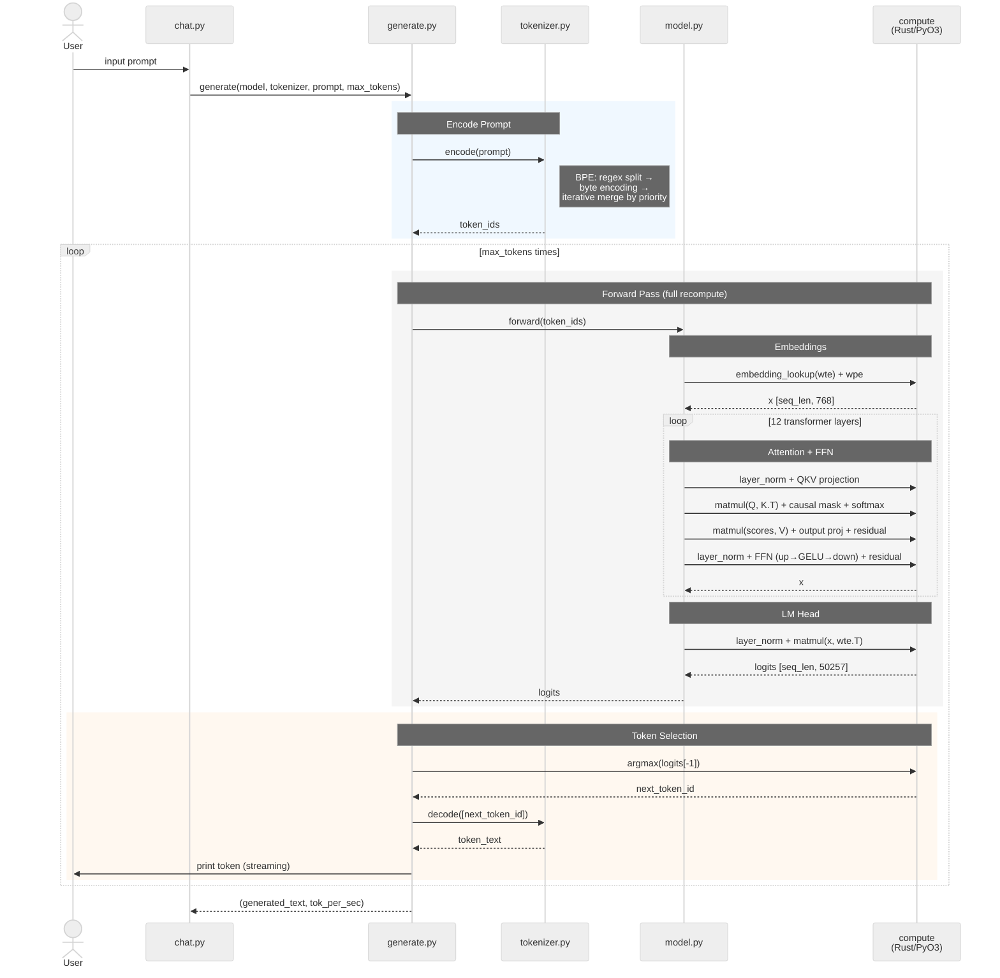

I built a from-scratch GPT-2 inference engine for educational purposes —
no frameworks, no shortcuts.  Rust handles the tensor math (via PyO3),
Python handles everything else: tokenizer, transformer, generation, and
CLI.  The full source is at
[github.com/fschmole/bare-bones-inference](https://github.com/fschmole/bare-bones-inference).

## Why

Most tutorials either hand-wave the internals or drown you in framework
abstractions.  I wanted to understand every layer — from byte-pair
encoding to attention masks to SIMD intrinsics — by implementing each
one and proving it correct against a golden reference.

## Architecture

The codebase is deliberately flat: one concept per file, no frameworks.

```
┌─────────────────────────────────────────────────┐
│  chat.py  — CLI interface (single-turn)         │
├─────────────────────────────────────────────────┤
│  generate.py — autoregressive loop (greedy)     │
├─────────────────────────────────────────────────┤
│  model.py — GPT-2 transformer (12 layers)       │
├──────────────────┬──────────────────────────────┤
│  tokenizer.py    │  loader.py                   │
│  BPE encode/     │  safetensors parser +        │
│  decode          │  config loader               │
├──────────────────┴──────────────────────────────┤
│  compute (Rust/PyO3) — tensor math              │
│  AVX2+FMA SIMD with naive scalar fallback       │
└─────────────────────────────────────────────────┘
```

| File | Purpose | Lines |
|------|---------|-------|
| `compute/src/tensor.rs` | Tensor struct, all math ops, SIMD kernels | ~1000 |
| `tokenizer.py` | GPT-2 BPE encode/decode | ~170 |
| `loader.py` | Safetensors binary parser + config | ~100 |
| `model.py` | Full GPT-2 forward pass | ~230 |
| `generate.py` | Greedy decoding loop | ~165 |
| `chat.py` | Interactive CLI | ~165 |

## Inference Flow

The repository README contains the full PlantUML sequence diagram
derived from actual trace output.  Here is a summary of the flow:



> The full diagram in the
> [repository README](https://github.com/fschmole/bare-bones-inference#inference-flow)
> shows every individual operation — QKV slicing, head splitting, causal
> masking, GELU, weight tying, and all residual connections.

## Key Design Decisions

- **No KV cache** — the full forward pass is recomputed for every
  token.  Slow (~1–2 tok/s with AVX2), but the code is simple and
  correct.
- **Greedy decoding only** — always picks the most probable next token.
  No temperature, top-k, or top-p.
- **F32 only** — no quantization, ~500 MB for GPT-2-124M.
- **CPU only** — no GPU or NPU offloading.
- **Weight tying** — the LM head reuses the token embedding matrix
  transposed, matching GPT-2's original design.

## Testing

All 130 tests compare against golden-reference libraries:

| Test Suite | Golden Reference | Tests |
|-----------|-----------------|-------|
| `test_tensor.py` | numpy | 49 |
| `test_tokenizer.py` | tiktoken | 32 |
| `test_loader.py` | safetensors | 27 |
| `test_model.py` | HuggingFace transformers | 13 |
| `test_generate.py` | HuggingFace `model.generate()` | 9 |

## What's Next

See
[plan.md](https://github.com/fschmole/bare-bones-inference/blob/main/plan.md)
in the repository for the full enhancement roadmap.

The complete source is at
[github.com/fschmole/bare-bones-inference](https://github.com/fschmole/bare-bones-inference).
